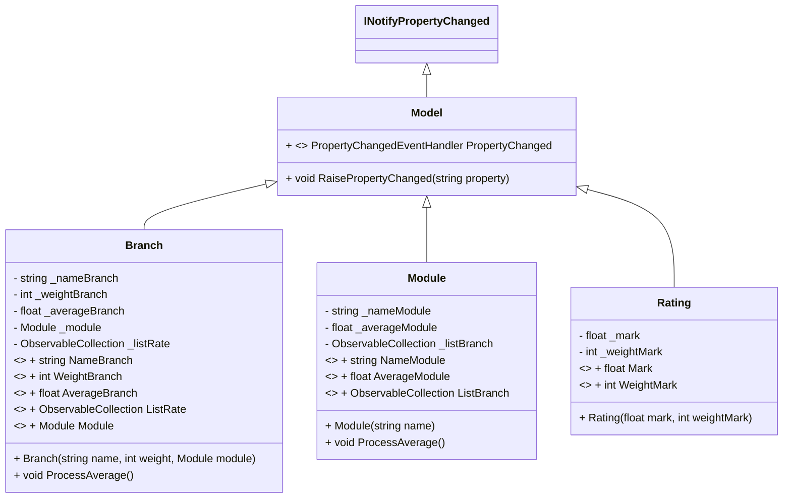
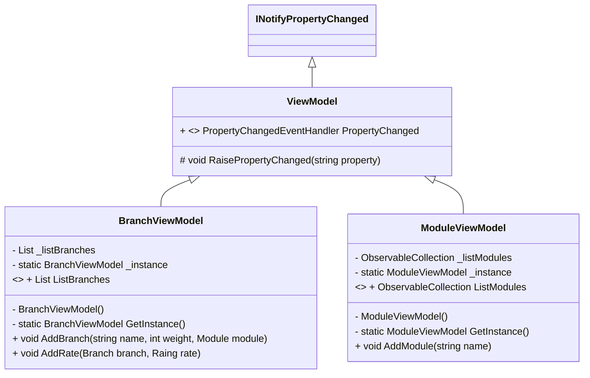
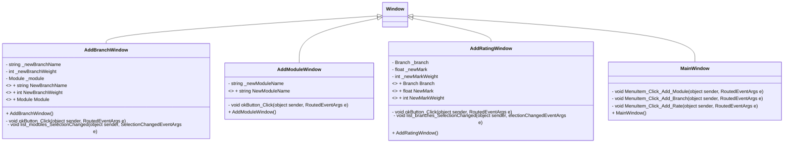
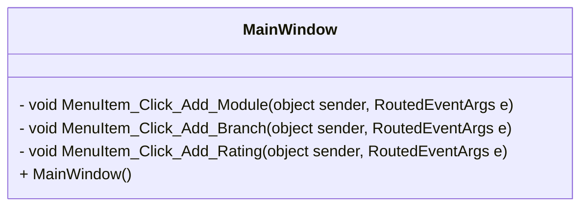
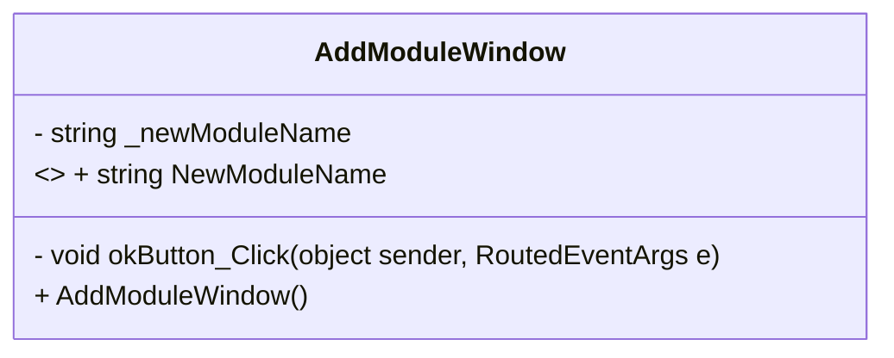
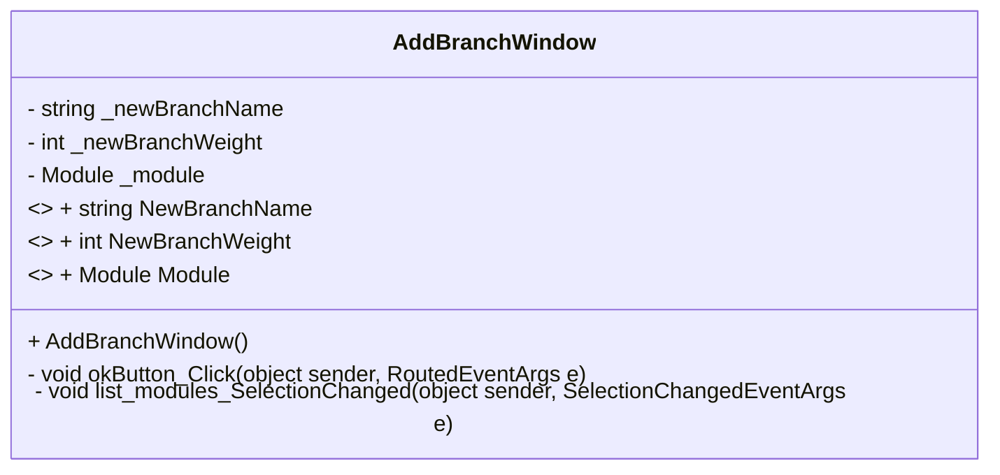
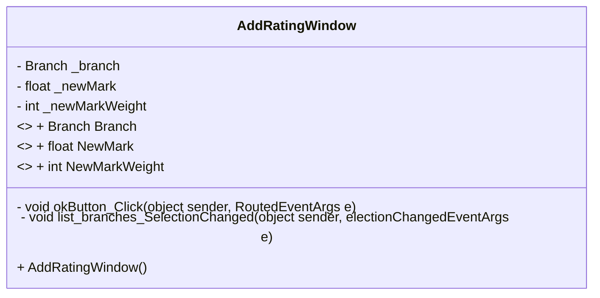

# Présentation SpreadsHeArc

###### par Gabriel Fasano

Note: Présentation de mon projet, réalisé en groupe avec moi-même

---

## Problèmatique

- Feuille Excel : configuration des formules :sleeping:
- Visualisation des données : 
Ca passe, ça passe pas ? :confused:

Note: "JE"; Constatation : Adaptation du fichier excel existant avec nouveaux modules et branches, adaptation des calculs, etc.
Ajout de couleur pour rendre plus lisible => adapté les contraintes

---

## Buts

- Calculateur flexible  mais spécialisé pour moyennes de branches et de modules

Note: Même si Excel marche très bien, outil plus spécialisé avec affichage plus clair

---

## Fonctionnalités

- Ajouter des modules
- Ajouter des branches à des modules
- Ajouter des notes aux branches
- Mise a jour automatique des moyennes
- Visualiser les moyennes de branches et de modules
- Couleurs selon critères de réussite

Note: Fonctionnalités de base; 
Donc on doit pouvoir faire ces actions et visualiser changements immédiatements

---

## Techno/Language

- WPF
- C#

---

## Objectifs
 
----

### Objectifs primaires

- Ajouter des modules
- Ajouter des branches à des modules
- Ajouter des notes aux branches
- Visualiser les moyennes de branches et de modules

Note: Identique aux fonctionnalités

----

### Objectifs secondaires

- Persistences des données :
    - Sauvegarde des données (BDD)
    - Export des données en JSON :writing_hand: 
    - Import des données en JSON

Note: Pour la persistence des données, chargement et export

---

## Démo

:computer: 

---

## Développement

---

### Architecture MVVM

Note: Utilisation de l'architecture MVVM

----

#### Models

Note: Pas le plus intéressant; Tous les modèles héritent de Model, qui implémente INotifyPropertyChanged pour réagir aux changements dans les données.

----

#### ViewModels

Note: Les viewModel héritent de ViewModel qui implémente INotifyPropertyChanged. Les ViewModel sont des singleton. Nécessaire car besoin de référencer les instances de branche et de modules et garder des listes.

----

#### Views

Note: Evidemment code XAML, ici que code behind; Peu visible, slide suivante, pas très intéressant, passage rapide ...

----

##### MainWindow

Note: Evénements dans la barre de menu; pas grid; stackpanel imbriqué

----

##### AddModuleWindow

----

##### AddBranchWindow

Note: Nom branche, poids, nom module

----

##### AddRatingWindow

Note: Mark = une note; Rating = poids + note; 
Chiffre à virgule non reconnu sur cette ordinateur. Poids pas en dur

---

### Binding

- Liste déroulante des modules

- Liste déroulante des branches

- Mise à jour des branches/modules/moyennes

---

## Améliorations

- Design
- Exportation des données
- Importation des données

---

## Problème connu

- Nombres à virgule

---

## Conclusion

- Objectifs principaux :heavy_check_mark: 
- Délais respectés :heavy_check_mark:
- Besoin de persistance sinon inutile

---

## Merci de votre attention
:sleeping:

---

# Questions :question: 